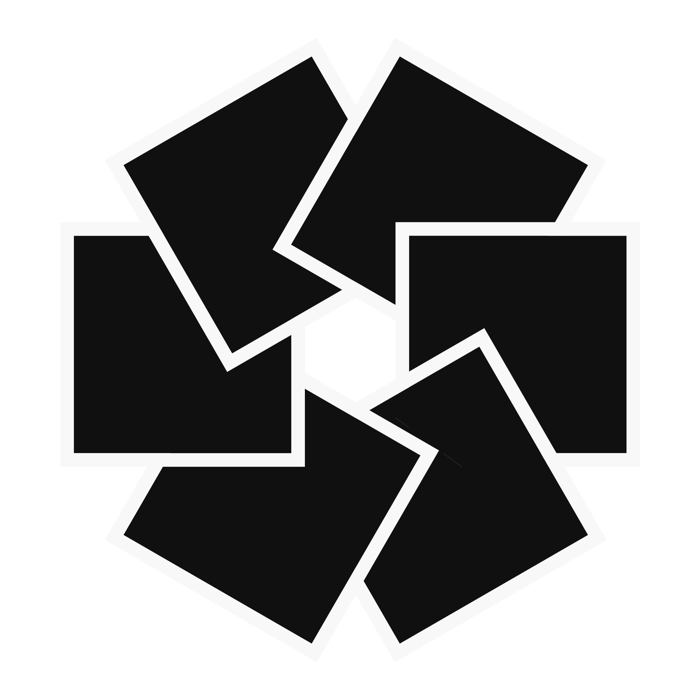
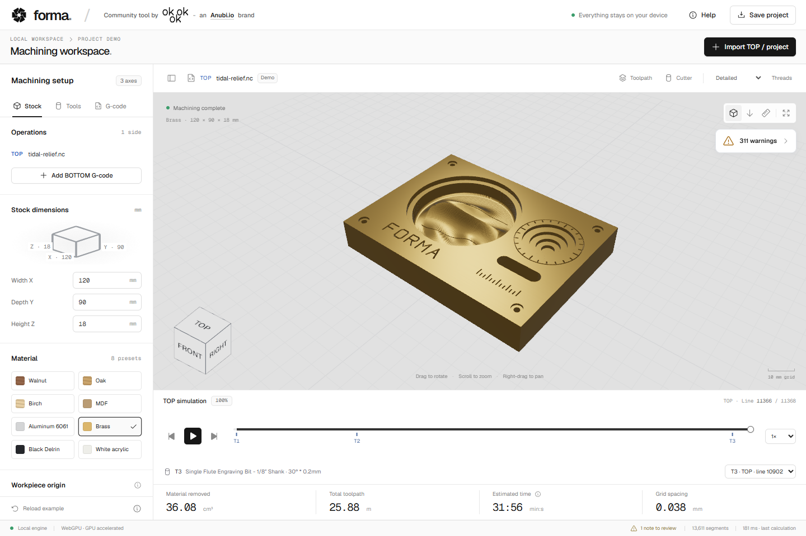

<div align="center">



# Forma / CNC Preview

**See what your G-code leaves behind.**

A browser-based 3-axis CNC preview for the Makera community.
Import your program, match your tools, and explore the machined part in 3D.

[Get started](#get-started) · [Makera workflow](#from-makera-studio-to-forma) · [Compatibility](#compatibility) · [Contribute](CONTRIBUTING.md)



</div>

Forma simulates material removal from G-code, with a Makera tool catalog, optional Makera Studio project import, and a timeline you can scrub in either direction. Everything runs on your device: no account, backend, telemetry, or program uploads.

Created by [OKOKOK design](https://okokok.design/), an [Anubi.io](https://anubi.io/) brand. An independent community project, not affiliated with or endorsed by Makera.

## What you can do

- **Preview the finished part.** Simulate flat, ball-nose, and V cutters; inspect the remaining stock, toolpath, and removed volume.
- **Bring your Makera setup.** Read plain or compressed Makera NC files and import stock dimensions and tool assignments from a matching `.mks` project.
- **Machine both faces.** Combine TOP and BOTTOM programs, choose their order, and flip the stock around X or Y.
- **Inspect thread milling.** Enable an optional WebGPU simulation of an idealized single-form thread cutter.
- **Review your program.** Find repeated paths, air cuts, inefficient Z returns, and potential machining issues, with links to the relevant position in 3D.
- **Explore at your own pace.** Play, rewind, jump to tool changes, or click disconnected pieces to isolate them.
- **Keep your work.** Resume the automatically saved browser workspace or export a portable `.forma.json` project.

> Forma is a preview and review tool, not machine verification software. It does not check collisions with the spindle, tool holder, fixtures, or machine. Always verify your setup and program before machining.

## Get started

You need **Node.js 22.12 or later** and npm, plus a browser with WebGL2. WebGPU accelerates simulation when supported by your browser and device; otherwise Forma uses a CPU worker and WebGL2.

Download or clone this repository, open a terminal in its folder, and run:

```sh
npm ci
npm run dev
```

Open the local address printed by Vite. The built-in **Tidal relief** demo is ready to explore: a brass plate with a sculpted relief, concentric pockets, a through-slot, counterbored holes, and engraved lettering, all generated from G-code.

For a production build:

```sh
npm run build
npm run preview
```

The static output is in `dist/`. Serve it at the root of a static website. WebGPU requires **HTTPS or localhost**; opening `index.html` directly from disk is not supported. Vite's preview server is for checking the build locally.

## From Makera Studio to Forma

1. **Import your G-code** with **Import TOP / project**, or drop it onto the window. Plain-text G-code and supported compressed Makera `.nc` files are accepted.
2. **Import the matching `.mks` project** when prompted, or choose manual setup. You can also import it later from **Tools → Import stock & tools from .mks**.
3. **Check your stock and origins.** MKS import sets rectangular stock dimensions and tool assignments. **XY and Z origins are not imported**: verify them against your CAM setup in the Stock tab. Recognized aluminum metadata updates the material; other materials keep the current selection.
4. **Match every T number to the correct cutter.** Choose from the Makera catalog or define a custom tool. Forma never assumes that T1 identifies a particular cutter. Importing a new TOP program clears the previous assignments.
5. **Explore the result.** Rotate, pan, and zoom; toggle the toolpath and cutter; scrub the timeline or click a T marker to jump to a tool change.
6. **Save a portable copy** with **Save project**. Reimport the resulting `.forma.json` to restore stock, tools, and G-code in another browser.

MKS import reads project metadata, not the binary scene. It supports 3-axis projects in millimeters with rectangular stock and recognized cutter profiles. Unsupported or unverified profiles remain available in toolpath-only mode. Conflicting geometries for the same T number and invalid stock dimensions are rejected without applying a partial setup.

### Two-sided machining

After importing TOP, select **Add BOTTOM G-code**. In Operations, choose **TOP → BOTTOM** or **BOTTOM → TOP**, then a 180° flip around the stock center on **X** or **Y** (the default).

Both programs share stock settings and tool assignments by T number. The same origin settings are re-established on each face. The second operation preserves material removed by the first, and both operations share one timeline. Order, flip axis, and both programs are included in saved projects.

### Thread milling and separate pieces

**Threads** enables thread material removal on WebGPU. It starts disabled each time you open the app and caps quality at **Detailed**. The programmed helix determines the thread's pitch and direction; the cutter uses an idealized single-form tooth. Catalog neck diameters are estimates and can be overridden with a custom tool. On CPU, thread tools and paths remain visible but their material removal is excluded.

When playback is stopped, hover over disconnected material to highlight it and click to isolate it. Click again to restore the full view. Seeking, resuming playback, or changing the setup clears the selection. Thin connections below the simulation resolution may be missed; separations created solely by thread undercuts are not detected.

### Program review

The floating review button opens **Optimizations**, with filters for time-saving opportunities and machining warnings. **Show in 3D** jumps to an occurrence; **Why?** explains it.

Checks include repeated toolpaths, passes without material removal, repeated Z returns, rapid moves through remaining stock, cutting beyond stock bounds or flute reach, missing feed/spindle settings, and aggressive entries. Some warnings, such as cutting through the stock or beyond its XY edges, may be intentional.

**Potentially optimizable time** is the deduplicated duration of flagged moves, not guaranteed savings. Forma does not rewrite your G-code. Analysis uses a separate stock approximation and material-dependent heuristics; **100% scanned** does not mean every geometry can be evaluated. Coverage limits are shown in the panel.

## Compatibility

| Area                  | Support                                                                                                                            |
| --------------------- | ---------------------------------------------------------------------------------------------------------------------------------- |
| Input                 | Plain UTF-8 G-code, Makera QuickLZ 1.5 containers (non-streaming levels 1 and 3), `.forma.json` backups, and `.mks` setup metadata |
| Linear moves          | `G0`, `G1`; rapid moves do not remove material                                                                                     |
| Arcs                  | `G2`/`G3`, `G17`/`G18`/`G19`, I/J/K or R, negative R, and helical moves                                                            |
| Units and coordinates | `G20`/`G21`, `G90`/`G91`, `G90.1`/`G91.1`, `G94`, and `G54` in the selected workpiece coordinate system                            |
| Tools and spindle     | `T`/`M6`, `S`, `M3`/`M4`/`M5`; `M7`/`M8`/`M9` accepted                                                                             |
| Program control       | `M2`/`M30` end the program; `M0`/`M1` do not simulate operator pauses; `G4` dwell is excluded from time estimates                  |
| Cancellation codes    | `G40`, `G49`, `G80`; a new motion command is required after `G80`                                                                  |
| Cutter removal        | Flat, ball-nose, and V profiles on CPU/WebGPU; supported thread mills on WebGPU only                                               |
| Other tools           | Drill bits, tapered ball-nose cutters, and other special profiles use toolpath-only mode and do not contribute to removed volume   |

**G28 handling:** homing without axis coordinates is reported and excluded from the path and timing. Continuing afterward requires an explicit `G90 G0` reposition with X, Y, and Z; that transfer is also excluded. `G28` with intermediate axis coordinates is rejected.

**Not supported:** rotary axes, 4/5-axis machining, turning, general undercuts or side machining, canned cycles such as `G81`, macros, subroutines, multiple work offsets, `G53`, `G41`/`G42`/`G43`, and `G92`. Unknown instructions stop the preview and report the line number.

### Accuracy and practical limits

- Surface and volume are grid approximations. Check the displayed grid spacing; features smaller than it are not reliable. Arc interpolation has a maximum chord error of 0.02 mm.
- Quality ranges from **Draft** to **Ultra-detailed**, with **Detailed** as the default. Resolution depends on the active backend and device limits. Higher settings use more memory and may take longer.
- Playback advances by segments, not real machine time. Time estimates use programmed feed and an assumed rapid speed of 3,000 mm/min, without acceleration, dwell, or tool-change time. Missing feed uses 600 mm/min and produces a warning.
- Material settings affect appearance and review heuristics. Forma does not model cutting forces, deflection, or certified feeds and speeds.
- Each G-code file is limited to **25 MB**, including decompressed input. Project backups are limited to **55 MB**. MKS archives are limited to **25 MB**, with **4 MB** of expanded metadata. Programs are limited to one million movement segments; device and simulation budgets may impose additional limits.

## Your files stay local

G-code, setup, display settings, and playback position are saved automatically in this browser using local storage and IndexedDB. Reopening restores the workspace with playback paused. Clearing site data removes that local copy; use **Save project** for backups.

The application includes local fonts and procedural materials, with no remote texture downloads or telemetry. External product and credit links open their respective websites when clicked. The optional catalog maintenance script fetches public Makera product data.

## Contributing

Bug reports, small reproducible G-code examples, compatibility fixes, and UI improvements are welcome. Please read [CONTRIBUTING.md](CONTRIBUTING.md) for setup, checks, and what to include in a report. Only share machining files you have permission to publish.

Built with TypeScript, React, Vite, Three.js, React Three Fiber, and Web Workers. Simulation uses WebGPU compute with a CPU fallback. Catalog sources, geometry assumptions, and dependency notices are documented in [THIRD_PARTY_NOTICES.md](THIRD_PARTY_NOTICES.md).

## License

Forma is released under the [MIT License](LICENSE). You may use, modify, share, and sell the software, including in commercial and proprietary projects, provided you retain the copyright and license notice. No source disclosure is required.

Your G-code, designs, and manufactured parts remain yours. Third-party components retain their own licenses; see [THIRD_PARTY_NOTICES.md](THIRD_PARTY_NOTICES.md).
